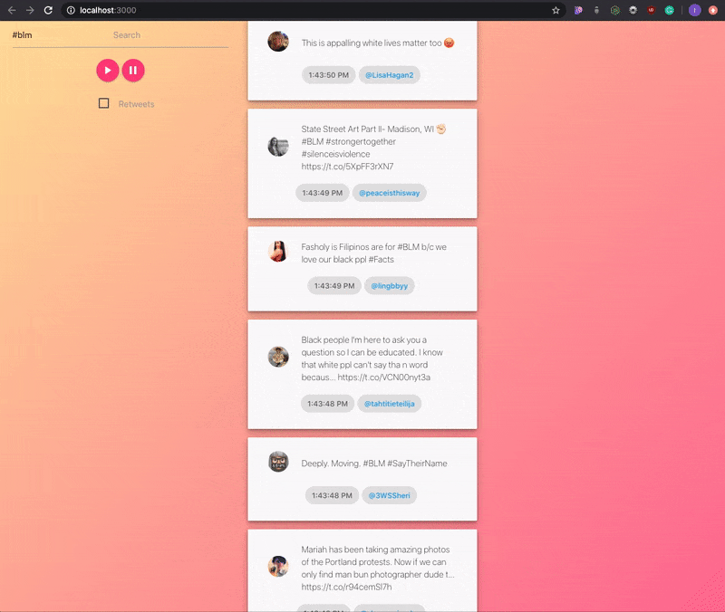

# Twitter Twitter Little Star

I built a real time application using react, express, and socket IO to display tweets.



## Getting Started

1. Clone Project
2. `npm install`
3. `npm run start`
4. `cd src/server; node server.js`
5. Checkout [localhost:3000](http://localhost:3000) for the app! 

### Prerequisites

What things you need to install the software and how to install them

```
Node.js
npm
```


## Built With

* [socket.io](https://socket.io) - Real Time tracking
* [Twitter API](https://developer.twitter.com/en/docs) - Track tweets
* [Express](https://www.npmjs.com/package/express) - Create API


## License

This project is licensed under the MIT License - see the [LICENSE.md](LICENSE.md) file for details
